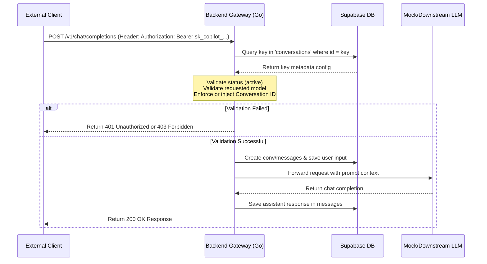

# Desktop AI (MINI PERPLEXITY)

**Universal Desktop AI Copilot** is a powerful Electron-based assistant that bridges the gap between your desktop applications and your favorite AI providers (ChatGPT, Gemini, etc.). It provides a context-aware, persistent overlay that understands what you're working on without needing API keys.

---

## 🌟 Key Features

-   **Universal Context ID (UCID):** Automatically detects the active project or document you're working on in VS Code, Android Studio, Microsoft Word, PowerPoint, and more.
-   **Zero-Config AI Integration:** Uses hidden browser instances to interact with your existing AI web accounts (ChatGPT, Gemini). No expensive API keys or complex setups required.
-   **Context-Aware Chat:** Maintains separate conversation histories for different projects, allowing for seamless context switching.
-   **Screen Analysis:** Capture your current screen with a single shortcut and ask the AI to analyze it instantly.
-   **Floating Overlay:** A sleek, always-on-top chat interface that stays accessible while you work.
-   **Global Shortcuts:** Trigger the copilot from anywhere in your OS with customizable hotkeys.
-   **Project Management:** Organize your AI interactions into logical projects that map to your real-world workflow.

---

## ⌨️ Global Shortcuts

The Copilot is designed to be keyboard-first. Use these shortcuts from any application:

| Shortcut | Action |
| :--- | :--- |
| `Ctrl+Shift+Space` | **Analyze Screen:** Captures a screenshot and opens the input window. |
| `Ctrl+Shift+Q` | **Quick Question:** Opens a text-only input window. |
| `Ctrl+Shift+O` | **Toggle Overlay:** Show or hide the floating chat window. |
| `Ctrl+Shift+P` | **Toggle Projects:** Manage your projects and context mappings. |
| `Ctrl+Shift+H` | **Conversation History:** Browse previous chats. |
| `Ctrl+Shift+N` | **New Project:** Quickly create a new context-mapped project. |
| `Ctrl+Shift+R` | **Reload AI:** Refresh the underlying AI provider state. |
| `Escape` | **Cancel/Close:** Cancel an active request or close windows. |

---

## 🛠️ How It Works

### Context Detection
On Windows, the application uses PowerShell to monitor the foreground window. It extracts metadata like window titles and process names to generate a **Universal Context ID (UCID)**.
-   **VS Code:** `vscode::[Project Name]`
-   **Android Studio:** `androidstudio::[Project Name]`
-   **Word/PowerPoint:** `[word/powerpnt]::[Document Name]`

### Browser-Based AI
Instead of using REST APIs, this app manages "hidden browsers" (Electron BrowserViews). It automates the web UI of ChatGPT and Gemini by:
1.  **Injecting Prompts:** Directly into the web-based textareas.
2.  **Streaming Responses:** Using `MutationObserver` to watch for DOM changes and stream the AI's response back to the overlay in real-time.

---

## 🚀 Getting Started

### Prerequisites
-   **Node.js** (v18 or higher recommended)
-   **npm**
-   **Windows OS** (Required for PowerShell-based context detection; basic features work on other OSs)

### Installation
1.  Clone the repository:
    ```bash
    git clone https://github.com/your-repo/desktop-ai-copilot.git
    cd desktop-ai-copilot
    ```
2.  Install dependencies:
    ```bash
    npm install
    ```
3.  Start the application:
    ```bash
    npm start
    ```

### Usage
-   Upon startup, the app will initialize in the system tray.
-   Use `Ctrl+Shift+O` to open the overlay.
-   Select your preferred AI provider in the settings.
-   Log in to the AI provider through the browser window if prompted.

---

## 📁 Project Structure

-   `src/main/`: Electron main process logic (shortcuts, state, context detection).
-   `src/providers/`: Logic for managing hidden browsers and AI-specific selectors.
-   `src/overlay/`: Frontend for the main chat interface.
-   `src/input/`: Frontend for the quick command bar.
-   `src/projects/`: UI for project and context management.

---

## 🔑 API Key Gateway & Authentication System

The Copilot includes a secure, Supabase-backed API Key management and gateway authentication system. The backend gateway (`backend-gateway`) acts as a secure reverse proxy that authenticates incoming external requests, maintains conversation context, and enforces model access permissions.

### ⚙️ How It Works



### 🔐 API Key Management (Electron UI)

API keys are managed directly from the **Settings** screen inside the Electron app. 

1. **Generation:** 
   - Generates a cryptographically secure key (`sk_copilot_...`).
   - Securely stores the key as a configuration record in the remote Supabase database `conversations` table, marked with `type: "api_key_config"` inside the `metadata` JSONB column.
   - Saves username, password hash (SHA-256), allowed models, and a unique linked conversation ID.
2. **Access Control (Verify & Reveal):**
   - For security, generated keys are never shown in plain text in lists.
   - To view/reveal the plain API key, the user must authenticate by providing their username and verification password. The application verifies this against the hashed password stored in Supabase.
3. **Key Revocation:**
   - Keys can be set to `"active"` or `"inactive"`. Inactive keys are immediately rejected by the gateway.

### 🚀 Backend Gateway Setup

1. **Compile & Build the Gateway:**
   ```bash
   cd backend-gateway
   go build ./cmd/gateway
   ```
2. **Configure Environment Variables:**
   Create or update the `.env` file in the root directory:
   ```env
   SUPABASE_URL=https://cowmafailphyzkvodjdl.supabase.co
   SUPABASE_KEY=your-supabase-service-role-key
   PORT=8080
   ```
3. **Run the Server:**
   ```bash
   go run cmd/gateway/main.go
   ```

### 📡 Gateway API Validation Rules

When an external client requests the `/v1/chat/completions` endpoint:
- **Authentication:** Must provide an `Authorization: Bearer sk_copilot_...` header or an `x-api-key` header.
- **Status Check:** The key must have `status: "active"`.
- **Model Authorization:** The gateway compares the requested `model` field in the JSON body with the allowed models list (`available_models` in key metadata). Supports wildcard `*` to allow all models. Mismatched models return `403 Forbidden`.
- **Context Linkage (Conversation ID):**
  - If `conversation_id` is omitted in the JSON body, the gateway automatically injects the linked `conversation_id` from the key's metadata configuration.
  - If `conversation_id` is provided in the JSON body, it **must match** the linked `conversation_id` for that key, otherwise the gateway returns `403 Forbidden` to enforce security boundaries.

### 🧪 Automated Integration Verification

We have provided a complete integration test suite to verify the authentication system end-to-end against remote Supabase keys without needing upstream LLM accounts.

Run the test suite:
```bash
node test-api-key-bot.js
```
The test suite:
1. Dynamically provisions mock active, inactive, and wildcard keys in remote Supabase.
2. Boots up a downstream mock LLM server on port `8081`.
3. Runs the Go gateway local server on port `8080` configured to proxy to the mock LLM server.
4. Executes test cases asserting:
   - Rejected fake/missing keys (`401 Unauthorized`)
   - Rejected inactive keys (`401 Unauthorized`)
   - Model access filters (`403 Forbidden`)
   - Conversation ID context enforcement (`403 Forbidden`)
   - Successful proxying and message record verification inside the remote Supabase `messages` table (`200 OK`)
5. Tears down test keys and messages to keep database clean.

---

## ⚖️ License

[MIT License](LICENSE)
